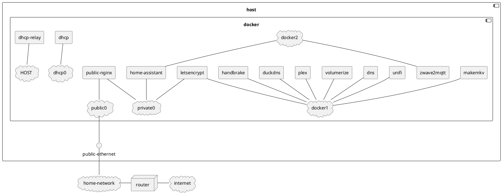

# Description

This role uses `docker-compose` to run a number of services on the target machine.  It creates several docker networks
in an attempt to isolate the blast radius should any container be compromised.  The resulting infrastructure looks like
this:

## Networks

### public0

This network is only accessible to the host interface that is exposed to the internet.  Its purpose is theoretically to
make `nginx` the only service that is accessible to the internet.  `iptable` rules are configured to ensure that no
connections can be initiated from within this network to any other systems on your network, or to the public internet.
These `iptable` rules will allow responses to requests or new connections that are associated with existing connections.

### private0

This is an internal docker network that the host system cannot access.  Its purpose is to allow nginx to proxy requests
to home assistant and letsencrypt.  `private0` is a bad name and this will likely be renamed `internal0` in the future.

### docker2

This network was created because home assistant requires access to the home network and the internet to function
properly.  As a result, it really defeats the purpose of the rules set up to protect the `public0` network.  If the
public `nginx` container becomes compromised, an attacker could theoretically work their way through the private0 and
docker2 networks to get access to the home network and public internet.  The correct solution to this issue is to set
up a VLAN used by all smart home devices, and to include the `public0` network on that VLAN. The `iptable` rules
preventing home assistant from accessing the network could be removed, and this network could be deleted. 

### docker1

This network is supposed to be the general purpose network used by all docker containers that do not need to be accessed
by the public internet.  It fails in that regard as `plex` needs to be publicly accessible.  Also, having `letsencrypt`
on this network provides a bridge from the `private0` network to `docker1`.  It should be trivial to remove
`letsencrypt` from this network.  `plex` can definitely be moved to the `docker2` network, but an ideal situation would
be to put it on the `private0` network behind the `nginx` proxy.

### dhcp0

This network specifies the subnet that it will use and is needed so that subnet can be provided to `isc-dhcp-server`.

### HOST

All efforts have been made to avoid using host networking, however in order for a dhcp relay to listen to multicast
traffic, host networking is a requirement.

## Volumes

The following directories are mounted, but are not named volumes.  They will be converted to volumes in the future:

### media_rip_config_dir

This directory stores the configuration for `makemkv`.

### transcode_dir

This directory stores the configuration for `handbrake`.

### dns_config_dir

This directory stores the configuration for the `bind9` DNS server.

### dns_cache_dir

This directory stores files cached by the `bind9` DNS server.

## Containers

The docker containers created by this role are documented in their own roles.  All containers will restart unless
explicitly stopped.  The following containers have interesting docker configuration that is worth noting:

### letsencrypt

This container is given the `NET_ADMIN` capacity to allow `fail2ban` to add `iptable` rules when it identifies malicious
IP addresses.

### public-nginx

This container is assigned a specific IPv4 address as home assistant needs to know this address when it is behind a
reverse proxy.

### dhcp

This container is given an explicit IP address because the DHCP server and the relay both need to know this IP address.

### dhcp-relay

This container is given the `NET_ADMIN` capacity to allow it to listen to multicast traffic.

# Initial Setup

You must configure a port on your router that will forward traffic to the server being configured.  The port that
receives that traffic must be set in the `public_port` variable. 

# Variables

| Variable                   | Required | Description                                                                                                        | Default          |
|:---------------------------|:---------|:-------------------------------------------------------------------------------------------------------------------|:-----------------|
| TZ                         | No       | The timezone in which the docker host is running.                                                                  | America/Toronto  |
| docker_address_pool_size   | No       | The CIDR suffix specifying how many addresses a docker network will be given.                                      | 24               |
| docker_address_pool_subnet | Yes      | The subnet from which docker networks will be allocated.                                                           |                  |
| docker_private0_subnet     | Yes      | The subnet that will be used for the `private0` network.                                                           |                  |
| public_port                | Yes      | The port that has been setup on your router to forward packets to the interface connected to the`public0` network. |                  |
| nas_address                | Yes      | The IP of the NAS used by docker.                                                                                  |                  |

# Parameters

| Parameter                   | Member     | Description                                                                   |
|:----------------------------|:-----------|:------------------------------------------------------------------------------|
| docker_local_volumes        |            | Local directories which will be available to docker containers as volumes.    |
 |                             | path       | The path to the directory.                                                    |
 |                             | volume     | The name of the volume.                                                       |
 | docker_nas_volumes          |            | NAS directories which will be available to docker containers as volumes.      |
 |                             | path       | The path to the directory on the NAS.                                         |
 |                             | volume     | The name of the volume.                                                       |
 | docker_services             |            | Docker services that will be created.                                         |
 |                             | config_dir | Optional.  The directory where configuration for the service will be created. |
 | docker_services_with_config |            | Names of docker services that have configuration directories                  |
