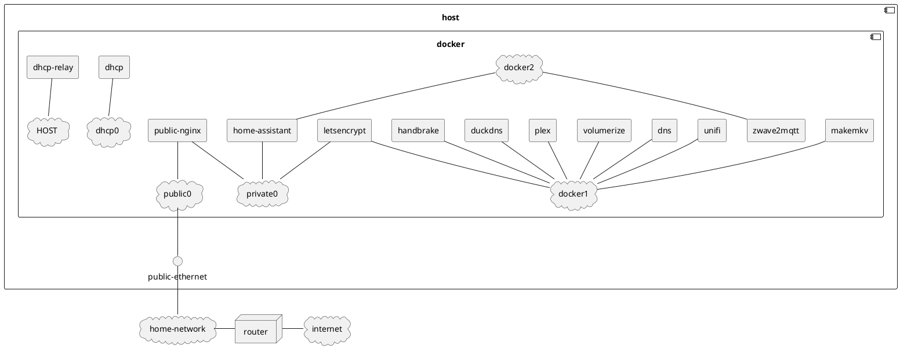

This role uses `docker-compose` to run a number of services on the target machine.  It creates several docker networks
in an attempt to isolate the blast radius should any container be compromised.  The resulting infrastructure looks like
this:

## Networks

### public0

This network is only accessible to the host interface that is exposed to the internet.  Its purpose is theoretically to
make `nginx` the only service that is accessible to the internet.  `iptable` rules are configured to ensure that no
connections can be initiated from within this network to any other systems on your network, or to the public internet.
These `iptable` rules will allow responses to requests or new connections that are associated with existing connections.

### private0

This is an internal docker network that the host system cannot access.  Its purpose is to allow nginx to proxy requests
to home assistant and letsencrypt.  `private0` is a bad name and this will likely be renamed `internal0` in the future.

### docker2

This network was created because home assistant requires access to the home network and the internet to function
properly.  As a result, it really defeats the purpose of the rules set up to protect the `public0` network.  If the
public `nginx` container becomes compromised, an attacker could theoretically work their way through the private0 and
docker2 networks to get access to the home network and public internet.  The correct solution to this issue is to set
up a VLAN used by all smart home devices, and to include the `public0` network on that VLAN. The `iptable` rules
preventing home assistant from accessing the network could be removed, and this network could be deleted. 

### docker1

This network is supposed to be the general purpose network used by all docker containers that do not need to be accessed
by the public internet.  It fails in that regard as `plex` needs to be publicly accessible.  Also, having `letsencrypt`
on this network provides a bridge from the `private0` network to `docker1`.  It should be trivial to remove
`letsencrypt` from this network.  `plex` can definitely be moved to the `docker2` network, but an ideal situation would
be to put it on the `private0` network behind the `nginx` proxy.

### dhcp0

This network specifies the subnet that it will use and is needed so that subnet can be provided to `isc-dhcp-server`.

### HOST

All efforts have been made to avoid using host networking, however in order for a dhcp relay to listen to multicast
traffic, host networking is a requirement.

## Volumes

```plantuml
	
@startuml

component host {
    database hassconfig as "hass-config"
    database hassdb as "hass-db"
    database letsencryptconfig as "letsencrypt-config"
    database letsencryptetc as "letsencrypt-etc"
    database fail2ban as "fail2ban-jails"
    database publicnginxconfig as "public-nginx-config"
    database publicngingxlog as "public-nginx-log"
    database privatenginxconfig as "private-nginx-config"
    database privatenginxlog as "private-nginx-log"
    database volumerizecache as "volumerize-cache"
    database volumerizecreds as "volumerize-credentials"
    database secrets
    database unificonfig as "unifi"
    database unifibackup as "unifi-backup"
    database media
    database plexconfig as "plex-config"
    database dhcpvol as "dhcp"
    database ripdestination as "media-rip-destination"
    database transcodesrc as "transcode-source"
    database trasscodedest as "transcode-destination"
    database zwaveconfig as "zwave-config"
    
    component docker {       
        agent handbrake
        agent makemkv
        agent unifi
        agent dns
        agent volumerize
        agent plex
        agent duckdns
        agent letsencrypt
        agent homeassistant as "home-assistant"
        agent publicnginx as "public-nginx"
        agent dhcp
        agent dhcprelay as "dhcp-relay"
        agent zwave2mqtt
    }
       
    hassconfig -- homeassistant
    hassdb -- homeassistant
    
    letsencryptconfig -- letsencrypt
    privatenginxconfig -- letsencrypt
    privatenginxlog -- letsencrypt
    publicngingxlog -- letsencrypt
    fail2ban -- letsencrypt
    
    letsencryptconfig -- publicnginx
    publicnginxconfig -- publicnginx
    publicngingxlog -- publicnginx
    
    volumerizecache -- volumerize
    volumerizecreds -- volumerize
    hassconfig -- volumerize
    letsencryptetc -- volumerize
    secrets -- volumerize
    unifibackup -- volumerize
    zwaveconfig -- volumerize
    
    unificonfig -left- unifi
    
    plexconfig -- plex
    media -- plex
    
    dhcpvol -up- dhcp
    
    ripdestination -up- makemkv
    
    ripdestination -up- handbrake
    trasscodedest -up- handbrake
    transcodesrc -up- handbrake
    
    zwaveconfig -- zwave2mqtt
}

@enduml

```

### hass-config

This directory stores the configuration for home-assistant.  `configuration.yml` is configured by ansible, but the
remaining files are generated by home assistant and backed up by `volumerize`.

### hass-db

The directory where the home assistant sql database is stored.  This data does not require backing up.

### letsencrypt-config

The configuration for the `letsencrypt` service.

### letsencrypt-etc

Files generated by the `letsencrypt` service, included the certificates it generates.  This directory is backed up by
`volumerize`.  It is also mounted by the `public-nginx` container to provide access to the generated certificates.

### fail2ban-jails

This directory contains `fail2ban` jails used to lock out IPs that appear to be malicious.

### public-nginx-config

This directory contains the configuration for the `nginx` server that is exposed to the public internet.  It contains
configurations required to access sites from the public internet and the local network.

### public-nginx-log

The directory where logs from the `nginx` server that is exposed to the public internet are written.

### private-nginx-config

This directory is deprecated.  It is still mounted by the `letsencrypt` container, theoretically to generate keys for
an internal only reverse proxy.  This volume will be removed in the future.

### private-nginx-log

This directory is deprecated.  It is still mounted by the `letsencrypt` container, theoretically to allow `fail2ban` to
analyze logs for an internal facing `nginx` server.  It will be removed in the future.

### volumerize-cache

This directory stores the `volumerize` cache used to generate incremental backups. 

### volumerize-credentials

This directory stores the credentials used by `volumerize` to write backups to the configured destinations.

### secrets

This volume points to the `group_vars/all` directory in this repository.  It is backed up by `volumerize` to ensure
there is a backup of those secrets.  This directory will be removed when secret storage is moved to the cloud.

### unifi

This directory stores the unifi controller configuration.

### unifi-backup

This subdirectory of the `unifi` volume is where the unifi controller stores it's monthly backups.  It is backed up by
`volumerize`.

### media

This directory stores media that will be served by `plex`.

### plex_config

This directory stores the `plex` configuraiton.

### dhcp

This directory stores the dhcp server configuration.

### media_rip_destination

This directory is used to store the files created by ripping CDs and DVDs.

### transcode_source

This directory is deprecated and will be removed in the future.

### transcode_destination

This directory is used to store files that are created by transcoding media stored in the `media_rip_destination`
volume.

### zwave-config

This directory contains the `zwave2mqtt` configuration.  `settings.json` is configured by ansible, but the remainder of
the content is generated by the service and backed up by `volumerize`.

### Other directories that are mounted

The following directories are mounted, but are not named volumes.  They will be converted to volumes in the future:

#### media_rip_config_dir

This directory stores the configuration for `makemkv`.

#### transcode_dir

This directory stores the configuration for `handbrake`.

#### dns_config_dir

This directory stores the configuration for the `bind9` DNS server.

#### dns_cache_dir

This directory stores the zone databases that `bind9` creates when DDNS records are added to the server.

## Containers

The docker containers created by this role are documented in their own roles.  All containers will restart unless
explicitly stopped.  The following containers have interesting docker configuration that is worth noting:

### letsencrypt

This container is given the `NET_ADMIN` capacity to allow `fail2ban` to add `iptable` rules when it identifies malicious
IP addresses.

### public-nginx

This container is assigned a specific IPv4 address as home assistant needs to know this address when it is behind a
reverse proxy.

### dhcp

This container is given an explicit IP address because the DHCP server and the relay both need to know this IP address.

### dhcp-relay

This container is given the `NET_ADMIN` capacity to allow it to listen to multicast traffic.

# Required Variables

The following variables are required by this role.  Variable provided by roles on which this container depends are not
listed.

- TZ: The timezone in which the docker host is running.  Defaults to `https://download.docker.com/linux/ubuntu`
- docker_address_pool_size: The CIDR suffix specifying how many addresses a docker network will be given.  Defaults to
  `24`, meaning each docker network will be allocated 256 IP addresses.
- docker_address_pool_subnet: The subnet from which docker networks will be allocated.
- docker_private0_subnet: The subnet that will be used for the `private0` network
- docker_compose_dir: The directory where `docker-compse.yml` will be installed.
- secrets_dir: The path to the `group_vars/all` directory on the docker host.
- public_port: The port that has been setup on your router to forward packets to the interface connected to the
  `public0` network.
